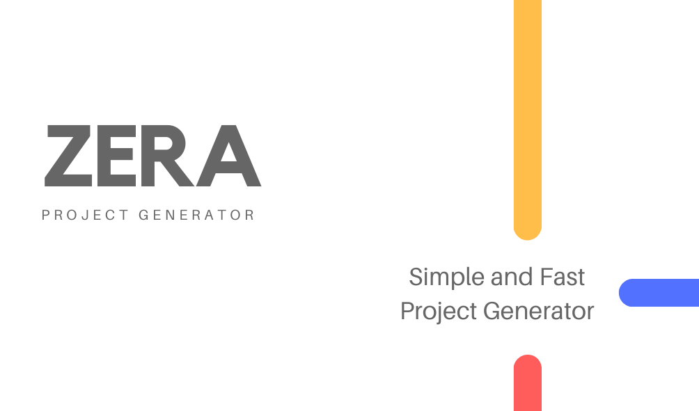

<div align="center">
  [](https://github.com/lucabecci/Zera-Generator/actions/workflows/build.yml)
  <h1> ZERA PROJECT GENERATOR </h1>
</div>



<div align="center">
<h3>Simple and fast Typescript/Javascript project generator written in Golang</h3>
</div>

# Quick Start ⌨️

## Get the project:

```go
git clone "https://github.com/lucabecci/zera-generator"
```

## Fast Run

if you don't want to install go, you can use the bin file to run the program. You need to run:

```go
make run
```

and the project will run on your console

### Install all dependencies:

```go
go install cmd/main
```

### Build the program:

```go
go build cmd/main
```

### Run the program:

```go
go run ./main

//or

./main
```

## Run and build the program with the Makefile:

### Build:

```go
make build
```

### Run:

```go
make run
```

# Templates 📂

- Typescript
  - Typescript-Express: use ⇒ `ts-expres`
  - Typescript-Mongoose: use ⇒ `ts-mongoose`
  - Typescript-TypeORM: use ⇒ `ts-typeORM`
- Javascript
  - Javascript-Express: use ⇒ `js-express`
  - Javascript-Mongoose: use ⇒ `js-mongoose`
- GraphQL
  - SOON...

# Pre-requeriments 🛠

You will need this requeriments for good rendiment:

- Golang 1.15

# Project Structure 📂

```
|-- .github
    |-- workflows
        |-- linter.yml
        |-- build.yml
|-- cmd
    |-- main
|-- docs
    |-- ZERA-BANNER.png
|-- internal
    |-- templates
        |-- error.go
        |-- Javascript.go
        |-- Typescript.go
    |-- about.go
    |-- scanner.go
    |-- templates.go
|-- pkg
    |-- dependencies
        |-- js_dependencies_builder.go
        |-- ts_dependencies_builder.go
    |-- file_information
        |-- js
            |-- index-express.txt
            |-- index-mongoose.txt
        |-- ts
            |-- index-express.txt
            |-- index-mongoose.txt
            |-- index-typeORM.txt
        |-- .gitignore.txt
        |-- README.txt
    |-- common_builder.go
    |-- js_builder.go
    |-- ts_builder.go
|-- .gitignore
|-- Dockerfile
|-- .dockerignore
|-- go.mod
|-- go.sum
|-- LICENSE.md
|-- Makefile
|-- README.md
```

# Build with 🛠

- Golang
- AuroraV3
- GoLint

# Versioned 1️⃣

For the versioning, [ConventionalCommits] was used ([https://www.conventionalcommits.org/en/v1.0.0/](https://www.conventionalcommits.org/en/v1.0.0/))

# Author 🙎🏻‍♂️

**\*Luca Becci -** code and documentation\*

- [github](https://github.com/lucabecci)
- [twitter](https://twitter.com/lucabecci)
- [linkedin](https://www.linkedin.com/in/luca-becci-b8044b198/)
